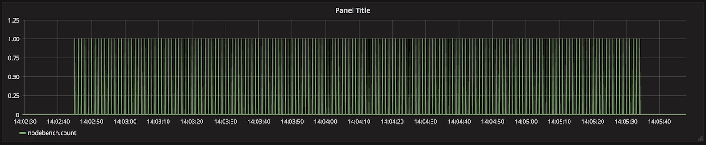

## docker-fluentd-logger

A dockerized setup to show node logging to standard out and having docker log driver send that to fluentd. This alleviates stress and event loop lag on node application and allows fluentd to deal with filter/parsing and eventual forwarding of logs.

### Overview
Node -> fluentd -> influxdb -> grafana



### Install
```
git clone github.com/shaunwarman/docker-fluentd-logger
```

### Run
```
cd docker-fluentd-logger

docker-compose up
```
